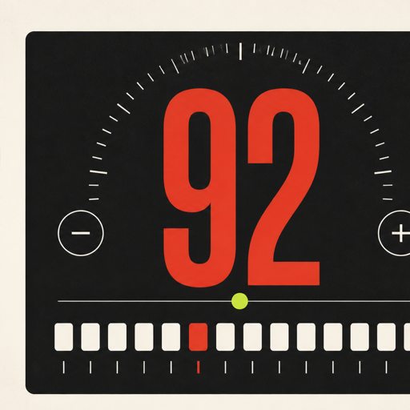
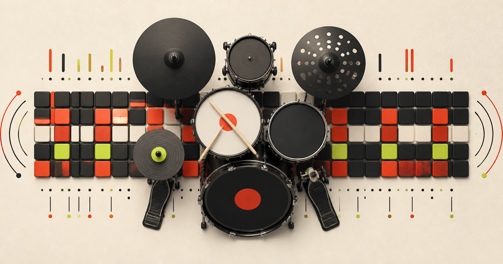

<p align="center">
  
</p>

<h1 align="center">drumgrid</h1>

<p align="center">
  An offline-first drum practice workstation with 200 curated patterns,<br>
  adaptive sessions, multi-voice sequencing and precise Web Audio playback.
</p>

<p align="center">
  <a href="https://drumgrid.ricke-schwaene-0f.workers.dev"><strong>Open the live app</strong></a>
  ·
  <a href="#features">Features</a>
  ·
  <a href="#development">Development</a>
  ·
  <a href="#deutsch">Deutsch</a>
</p>

<p align="center">
  
  
  
  
</p>

<p align="center">
  
</p>

## What it is

drumgrid combines a drum machine, metronome and adaptive practice coach in one installable web app. It is designed for focused practice without accounts, telemetry or a permanent network connection. Patterns, favorites, scenes and practice history stay on the device.

The library covers groove vocabulary from jazz, funk and hip-hop to metal, jungle, reggae, Latin styles and electronic music. Source-based song exercises are marked as reductions or reconstructions rather than presented as exact transcriptions.

## Features

| Area | Included |
| --- | --- |
| Pattern library | 200 curated drum patterns, multi-bar forms, search, style families, learning filters and favorites |
| Sequencer | Kick, snare, hats, cymbals, rim and tom lanes with accents, ghost notes and per-voice volume |
| Timing | Stable Web Audio scheduler, 20–300 BPM, tap tempo, meter, subdivisions, swing and original-feel microtiming |
| Practice | Free sessions, timing and groove sessions, tempo pyramids, gap click, random gaps, voice dropout and call-and-response |
| Feedback | Optional microphone transient analysis, timing markers, session recap and manual or measured latency correction |
| Sounds | Eleven compact sample kits plus a complete procedural precision kit |
| Personal data | Local scenes, custom patterns, recent items, practice history and JSON backup/import |
| Interface | German and English UI, five color themes, density and scale controls, reduced motion, high contrast and an optional floating desktop transport |
| PWA | Installable, offline-capable, atomic service-worker updates, kit download status and mobile safe-area navigation |

## Interface

The control-surface menu separates visual preferences from musical settings. Choose between Signal, Ultraviolet, Ember, Glacier and Mono; adjust UI scale and density; hide the coach or spectrum; and place the floating play/pause transport on the left, center or right of the desktop.

Keyboard controls:

| Key | Action |
| --- | --- |
| `Space` | Start or pause playback |
| `T` | Tap tempo |
| `+` / `-` | Change tempo by one BPM |

## Local-first data

- No account and no analytics
- No audio upload; microphone analysis stays in the current browser session
- Favorites, scenes, presets and results are stored in IndexedDB
- Backups can be exported and imported as JSON
- UI preferences are stored separately on the device

## Development

Requirements: Node.js 22.13 or newer.

```bash
npm install
npm run dev
```

The local app is served at `http://localhost:3000`.

### Quality checks

```bash
npm run typecheck
npm run lint
npm test
```

`npm test` creates a production build and runs the complete Node test suite. The catalog generator and its research material live under [`research/drum-patterns`](./research/drum-patterns).

### Production

```bash
npm run build
```

The production build targets Cloudflare Workers. `NEXT_PUBLIC_SITE_URL` can override the public base URL used for metadata.

Live deployment: [drumgrid.ricke-schwaene-0f.workers.dev](https://drumgrid.ricke-schwaene-0f.workers.dev)

## Project structure

```text
app/                       React UI, audio engine and local data layer
public/audio/drums/        Compact drum-kit assets
public/data/               Generated production pattern catalog
research/drum-patterns/    Reviewed sources and catalog generation data
scripts/                   Manifest and catalog generators
tests/                     Audio, catalog, PWA and rendered-UI checks
```

## Deutsch

drumgrid ist eine installierbare, offlinefähige Drum-Übungsstation mit 200 kuratierten Patterns. Die App verbindet Mehrspur-Sequencer, stabiles Metronom, adaptive Übemodi, optionale Timing-Analyse und lokale Fortschrittsdaten. Bedienoberfläche, Themes und Desktop-Transport lassen sich im Interface-Menü anpassen; die UI steht auf Deutsch und Englisch zur Verfügung.

Die App benötigt kein Konto und sendet weder Übedaten noch Mikrofonaufnahmen an einen Server.
